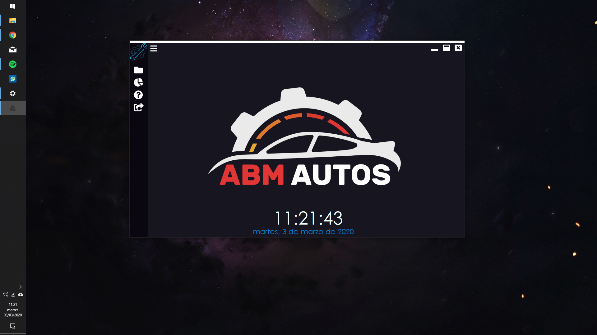
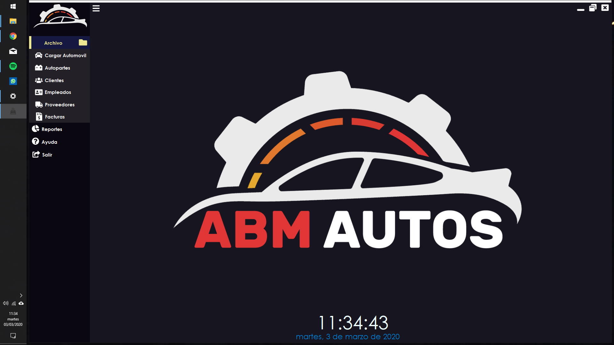
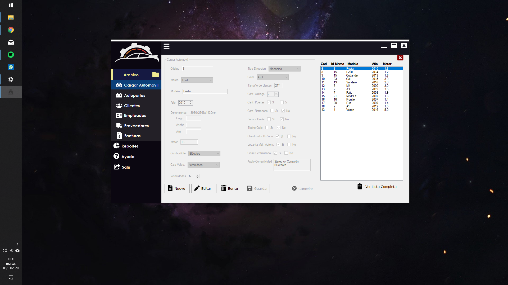
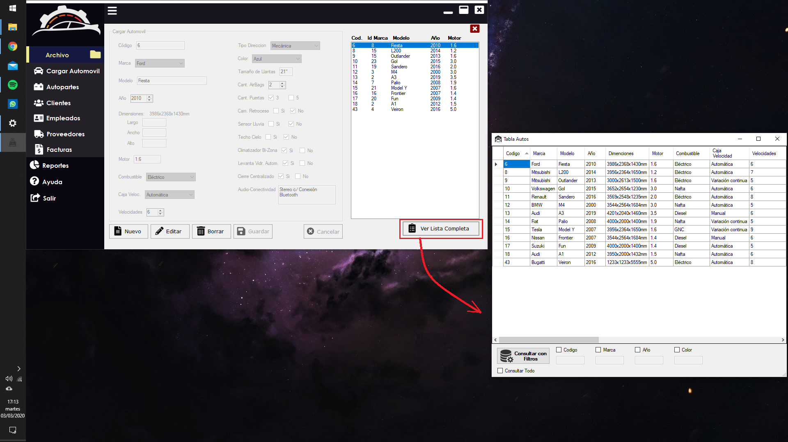
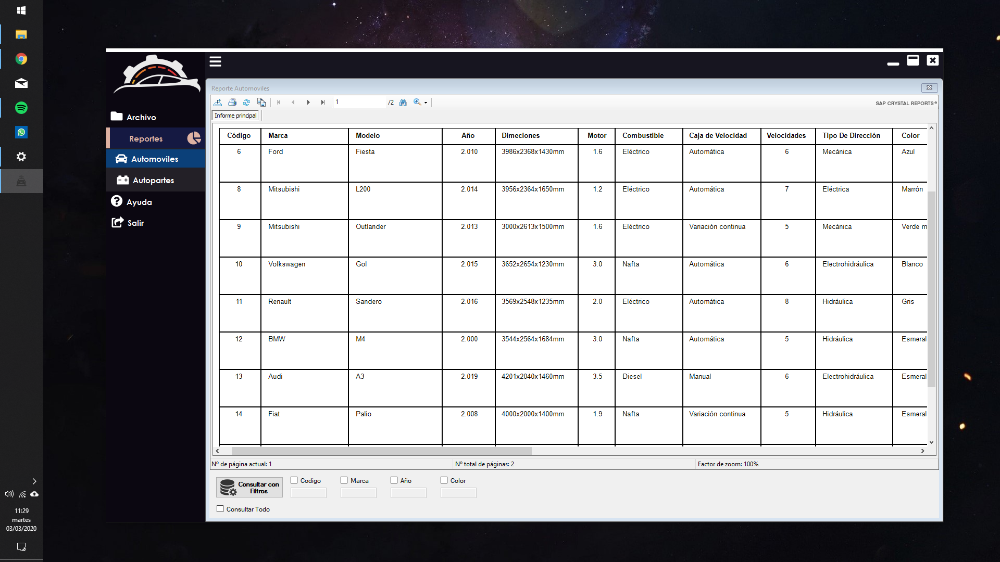
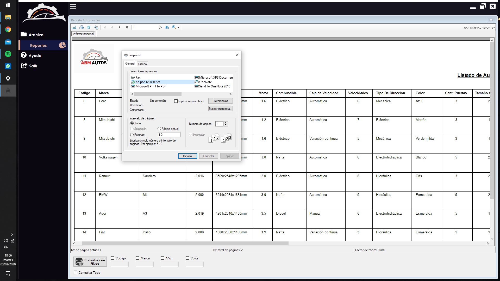

# Proyecto Automoviles
## Programa de escritorio para concesionaria 
Puede visualizar capturas del programa en funcionamiento antes de descargarlo si así lo desea, 
en la carpeta **'Capturas'** o [al final](#Capturas) de este documento. 
La Aplicación que se encuentra a continuación esta diseñada para poder crear, modificar o eliminar
registros de automóviles en una base de datos y consultar dichos datos a través de una tabla o 
un reporte. 
Por lo tanto, solo estan programadas las funcionalidades mencionadas anteriormente. Es por esto que
no todas las opciones que brindará el munú principal realizarán alguna acción. 
Solo funcionarán los botones de **Archivo/Cargar Automóvil** y **Reportes/Automoviles** y el Botón de Salir,
los otros botones que están como parte de la interfaz del menú principal no han sido programados.

### Nota
Para ejecutar la aplicación y que esta funcione correctamente deberia crear primero la base de datos
en SQL Server y después construir y pegar su cadena de conexión en el archivo de configuración de
la aplicación. De no saber cómo hacer todo esto, se encuentra adjunto un Tutorial en formato pdf el cual se encuenta en la carpeta *"Capturas*".  
Sino, puede ejecutarla igualmente, aunque las funcionalidades no andaran correctamente y 
es probable que aparezcan mensajes de error a los que tenga que ignorar para poder seguirla utilizando.

**El ejecutable de la App se encuentra en:** *ProyectoAutomoviles\WFAppTPi_ProgramacionII\bin\Debug\Automoviles.exe* 
Por otro lado, el script en SQL para crear la base de datos que se encuentra adjunto y se llama *SCRIPT_BD.txt*.

Esta DB esta diseñada para resolver el siguiente problema: 
**Sistema de Venta y Control de Stock** 
Una fábrica automotriz necesita un sistema para el control del stock y de lo que vende, como así
también de sus clientes, que pueden ser consumidor final, una empresa, un concesionario, o una
vendedora de autopartes. 
Los productos que la misma fabrica y vende son vehículos terminados o autopartes. De las autopartes se
cuenta con un stock y  se conoce el mínimo de stock que debe haber en inventario, en cambio para vehículos
no se cuenta con stock previo. 
Cuando un cliente quiere comprar vehículos, o autopartes que no se encuentran en stock se genera una orden
de pedido, y se le informa al cliente la fecha de entrega. Para el caso de autopartes en donde la cantidad
que haya en inventario cubra la cantidad pedida por el cliente, solo se genera una orden de pedido en el caso
de que la nueva cantidad de inventario sea menor al stock mínimo. 
Al momento de realizar la factura se asocia la orden de pedido en caso que haya alguna.
Los clientes que son consumidores finales tienen la posibilidad de entrar en un autoplan, lo cual implica que
al precio del producto se le aplicará una tasa de interés dependiendo de la cantidad de cuotas del plan. 
Por otro lado, las vendedoras de autopartes reciben descuentos en los productos por compras realizadas al por mayor.
La empresa además necesita conocer el historial de precios de sus productos.  

 

# Capturas

### Pantalla de Inicio y menú contraido

### Pantalla de Inicio maximizada y menú desplegado

### Funcionalidad: Cargar Automoviles

### Funcionalidad: Listar Automoviles

### Funcionalidad: Hacer Reporte

### Funcionalidad: Imprimir Reporte

   

**Nota:** Se encuentran capturas adicionales en la carpeta *"Capturas"*.